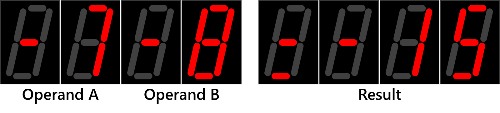

# The Library numeric_std

## Objectives

* To become familiar with the implementation of the numeric_std library in a VHDL system for arithmetic operations, by developing a simple signed 8-bit calculator.
* To develop a VHDL testbench for design simulation from scratch.
* To implement a 4x4 keypad as input peripheral to the FPGA and write the corresponding driver in VHDL.

## Pre-lab

### Background on *numeric_std*

Read the online documentation of the *numeric_std* library for VHDL and answer the following questions:
  1. What type of signals must be used to perform arithmetic operations using *numeric_std*?
  2. If your signed calculator design considers both, signed and unsigned numbers, which type of signal must be declared for the operands and result vectors?
  3. Show the syntax to convert from ```std_logic_vector``` to ``signed`` and ``unsigned`` signal types, and viceversa.
  4. Show the syntax to convert from ```integer``` to an 8-bit ```std_logic_vector``` data types, and viceversa.
  5. Show the correct VHDL syntax to carry out a multiplication of two vectors initially defined as ```std_logic_vector(7 downto 0)``` using the *numeric_std* library?
  
### 4x4 Keypad Interfacing

  1. Investigate the internal wiring of a 4x4 matrix keypad, and explain how to read and identify a pressed key.
  2. Write the pseudo-code of the keypad driver. Clearly identify the inputs and outputs.
  3. Draw the schematic diagram of the keypad including pull-up resistors with values, and connections to the FPGA. Depict with arrows all port directions (in, out or inout) from the FPGA point of view. 

## Lab work

Design in VHDL a signed calculator and implement your design in the Artix 7 FPGA following the design parameters shown below:

  * Only the *std_logic_1164* and *numeric_std* libraries are allowed to be called into the project.
  * The calculator must carry out three basic arithmetic operations: addition, subtraction, and multiplication.
  * Operands A and B, and the operation selection are introduced using a 4x4 keypad connected to GPIO pin header A of the Nexys 4 DDR board ([see Nexys 4 DDR Reference Manual](https://reference.digilentinc.com/reference/programmable-logic/nexys-4-ddr/reference-manual)).
  * Define inputs and outputs as in the following tables:

<div align="center">

Inputs    | Source        | Board pin
:---:     | :---:          | :---:
Clock     | Internal clock | E3
Operand A | Keypad         | C17, D18, E18, G17, D17, E17, F18, G18 
Operand B | Keypad         | C17, D18, E18, G17, D17, E17, F18, G18 
Operation selection | Keypad | C17, D18, E18, G17, D17, E17, F18, G18 

Outputs   | Outcome       | Board pin
:---:     | :---:         | :---:
Output data (operands, result and signs) | 7-segment displays | T10, R10, K16, K13, P15, T11, L18, H15
Display enable | 7-segment displays | U13, K2, T14, P14, J14, T9, J18, J17
Operation indicator | LEDs | J13, K15, H17

</div>

  * Use the diagram shown below to map the port signals of your design to the keypad:

  <p align="center">
  
</p>

  * The 7-segment display is used to display both operands and result in unsigned representation. Negative numbers are accompanied by a minus sign (-) at the immediate digit to their left. See the figure below as a reference (-7 + -8 = -15):

<p align="center">
  
</p>

  * Simulate your design using a Testbench that carries out the following 5 operations:

<div align="center">

Operation | Expected result 
:---:     | :---:
5 + 3     | 8
9 - 4     | 5
5 × 3     | 15
-8 + -5   | -13
6 × -2    | -12

</div>

## Technical report

The design and implementation process should be documented in the technical report, along with the full VHDL code. Your report must include the following sections:

* Introduction
  * Explain what you did in this laboratory. Include a brief exaplanation of each *.vhdl* file writen for your project, such as the main entity, peripheral drivers, and other components. Consider technical specifications such as the employed libraries, data types used, and other relevant information.
* Results
  * Link to video of the demo session
  * Link to GitHub with the VHDL source code
  * Screenshots of the testbench timeline showing inputs and outputs for the specified operations
  * Screenshots of the working implementation on the development board
* Individual conclusions

## Evaluation

<div align="center">

Criteria      | Weight [%]
:-----------: | :---:
Demonstration | 60
Report        | 25
Pre-lab       | 10
Attendance    | 5

</div>

<p align="right">Last update: March 14th, 2021 by Matías Vázquez</p>