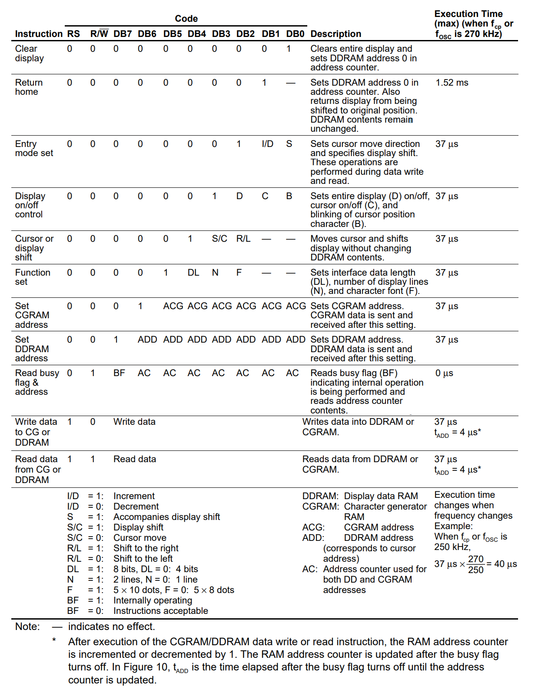

   

# 16x2 LCD Display Driver (draft)

## Objectives

To write the HDL driver for a 16x2 matrix LCD displays using Finite State Machines (FSM). 

## Pre-lab work
The 16x2 matrix LCD display is driven by the __HD44780 Dot Matrix LCD Controller/Driver__ integrated circuit. 

The following table shows the pinout for a 16x2 matrix LCD display. 

1. Check the pinout of the HD44780 LCD display driver

2. Check Table 6 on page 24 of the LCD display driver instruction set. 

3. Page 45 shows the generic flowchart for the LCD display initialization process, including values for signals `RS`, `RW`, `EN` and `DB`, as well as waiting times. Consider the following requirements:

    * 8-bit interface data
    * Two lines disaply
    * Display __on__
    * Cursor __on__ and __blinking__

2. Identify the instructions in the table below and complete with their respective function on the LCD display driver. 

Instruction | Code | Description
:---: | :---: | :---

2. What is the command to send to the LCD display to locate the cursor on the second line, first column?

3. Use the LCD display simulator to write the team members' first name on each line of the display. 

## Lab procedure

1. Write in VHDL the initialization sequence for the LCD display following the requirements from the pre-lab work. 

2. Write in VHDL LCD write code to display the team members' first name on each line of the LCD display. 

## Deliverables

## Evaluation