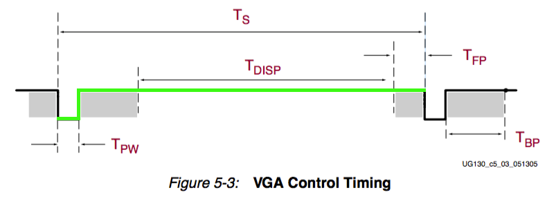
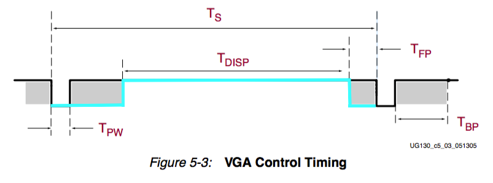
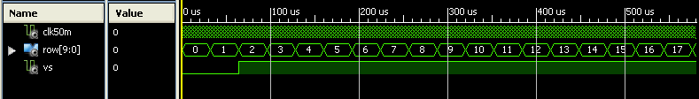
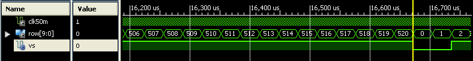
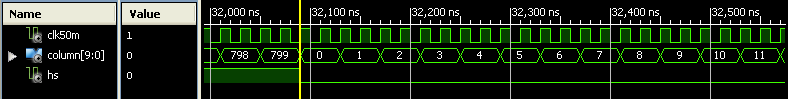
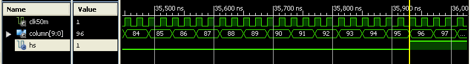
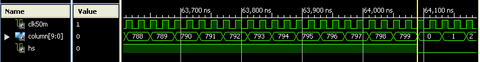
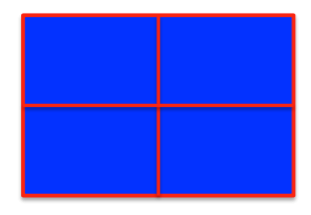

# Laboratory 10. VGA Controller

## Objectives
To design a VGA controller using HDL through synchronization signals generation. 

## Pre lab work

* Answer the following questions using as a reference Section 9 of the [Nexys 4 DDR FPGA Board Reference Manual](https://www.xilinx.com/support/documentation/university/XUP%20Boards/XUPNexys4DDR/documentation/Nexys4-DDR_rm.pdf):
  1. Which VGA signals we aim to control using the Artix 7 FPGA, and to which pins are these signals mapped to on the development board?

  2. Setting `HIGH` or `LOW` all three signals `R`, `G` and `B`, which colors are obtained?

  3. Why are there some time intervals that we cannot display any information?

  4. What pixel frequency is required to generate for a 640x480 screen resolution with a 60 Hz refresh rate?

* _Horizontal Sync_ and _Vertical Sync_ signal generation
  1. How could you generate _Horizontal Sync_ and _Vertical Sync_ signals using the Nexys 4 DDR board. Write the corresponding VHDL code. 

## Lab procedure

### __Part I. Driver development__
1. Design in VHDL a VGA display controller. Consider the following inputs and outputs:

Inputs | Length | Properties
:--- | :--- | :---
`Clock` | [1 bit] | freq @ 100 MHz
`Reset` | [1 bit] | Push-button

Outputs | Length | Properties
:--- | :--- | :---
`HS` | [1 bit]
`VS` | [1 bit]
`VIDEO_ON` | [1 bit]
`COLUMN` | [10 bits]
`ROW` | [10 bits]

`HS` and `VS` signals

`VIDEO_ON_H` and `VIDEO_ON_V` signals

`VIDEO_ON = VIDEO_ON_H AND VIDEO_ON_V`

2. Write a testbench to carry out a simulation stage for signal verification (`HS` and `VS` meet the timming criteria described in Reference Manual) before downloading your driver to the Nexys 4 board. 

3. Once the signals are verified on simulation, use an oscilloscope to verify the generated signals on the VGA port of the development board.

4. __ROW SIGNAL__. The timeline below shows a full period of `VS` signal, in which the count ranges from 0 to 520. 

5. __COLUMN SIGNAL__. Then, the following timeline shows a full period of `HS` signal, with count ranging from 0 to 799. 

### __Part II. VGA Display Testing__

6. Show on the display a blue background with red borders and screen dividers in equal parts, similar as the image shown below:

7. Show on the display the EBU colorbars, as shown below:

## Deliverables
The design and implementation process should be documented in the technical report, along with the full VHDL code and a demonstration video (3 minutes maximum). Your report must include the following sections:

1. Introduction
   * Explain what you did in this laboratory.
   * Include a brief explanation of each _.vhdl_ file written for your project (_e.g.,_ main entity, lower hierarchy RTL descriptions, peripheral drivers, etc.). Consider technical specifications such as the included libraries, data types used, and other relevant information.
2. Results
   * Screenshots of the working implementation on the development board
   * Link to video of the demo session
   * Link to GitHub repository of the full VHDL source code
3. Individual conclusions
   * Interpretation of results
   * Applications of and improvements of exercises
   * Justification in case of any errors

## Evaluation

Criteria | Weight 
:--- | :---:
Attendance | 5%
Pre-lab | 10%
Lab report | 25%
Demonstration | 60%

